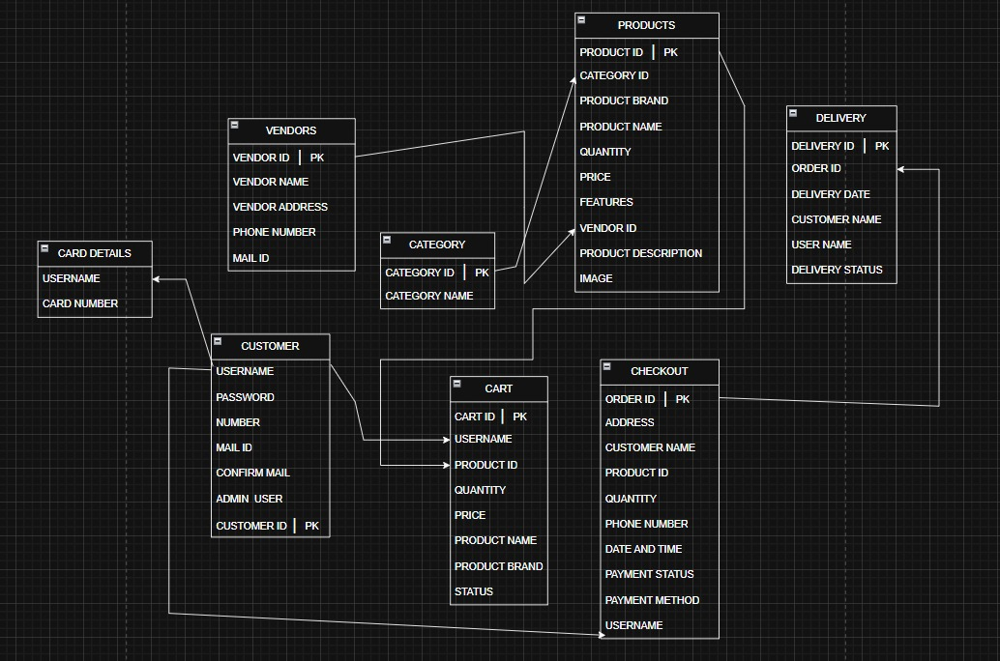

# E-commerce Web Application

This project is a a e-commerce web application built using Flask as the backend framework.I worked step by step to design, develop, and implement the features of a complete e-commerce site.

## Features
**User and Admin Authentication**

  * Login, signup, and session management
  * Role-based access (Admin can manage inventory, customers, and vendors; users can browse and shop)

**Product Management**

  * Add, edit, delete, and view products
  * Categories and vendors linked with products
  * Automatic product ID generation
  * Multiple image upload (via ZIP) stored in **AWS S3
  * Image display in tables, carousel, edit, and view pages

**Inventory And Vendors**

  * Manage categories and vendors (add, edit, delete, search)
  * Inventory table shows product details with vendor and category names

**Search, Sort, and Filter**

  * Search in inventory, customer list, and vendors
  * Sorting options in tables and product pages
  * Advanced filtering per category (CPU, Headphones, Keyboards, Monitors, Mice, Speakers)

**Homepage and Product Display**

  * Paginated homepage with product cards (image, name, brand, price)
  * Category-wise product pages with sorting and filtering
  * Responsive page structure

**Cart and Checkout**

  * Add to cart with quantity selection (up to 20 per item)
  * Cart page shows product image, brand, name, price, quantity, and total
  * Checkout page collects user details and payment method
  * Payment options: Cash on Delivery and Card
  * Delivery tracking system using Python’s datetime library

**Database and Diagrams**

  * ER Diagram designed in draw.io
  * Wireframes for page structure and flow

**Other Features**

  * Flask Blueprints for modular structure
  * Logging with info and debug levels
  * Error handling for invalid inputs and uploads
  * Flash messages for user feedback

## Technologies Used

* **Backend:** Flask (Python)
* **Frontend:** HTML, CSS, Bootstrap
* **Database:** PostgreSQL (with pgAdmin) 
* **Cloud Services:** AWS EC2, AWS S3
* **Tools & Libraries:** Flask Blueprints, Sessions, Logging, Error Handling, datetime
* **Design Tools:** ER Diagrams (draw.io)

